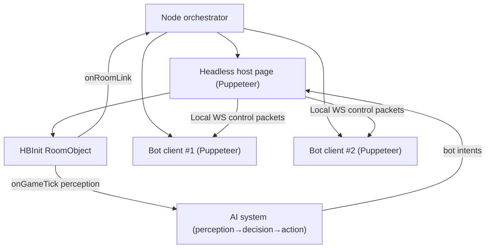

# Haxball Training Room Host + Cooperative Bots

A production-quality Node.js project that hosts a **private Haxball training room** (official headless host) and runs **1–2 cooperative passing bots** for solo drills (pass & move, wall pass, triangle support).

This project is designed for **you training alone** with bots that **help**, not compete.

## What’s truly possible (and why this architecture)

Haxball’s **official headless host API** is great for:
- Creating rooms (`HBInit`)
- Receiving events (`onPlayerJoin`, `onGameTick`, etc.)
- Reading game state (disc positions/ball/player discs via `getPlayerDiscProperties`, `getDiscProperties`, etc.)
- Managing teams and the match (start/stop, stadium, lock teams)

However, the official headless API does **not** provide a supported way for the host to directly “press keys” for a player entity. That means “AI bots” that move/kick like real players typically require **real client connections**.

So this repo uses a **two-layer architecture**:

1. **Host process (headless room)**: runs the room, loads your stadium (`bats_map.hbs`), reads authoritative positions, decides what bots should do.
2. **Bot client process(es)**: 1–2 automated browser clients join the room like normal players and execute inputs (move/kick) via controlled key state.

This is the most practical, robust, “official-API-friendly” way to get **real moving bots**.

## Architecture overview



## Features

- **Private by default**: passworded room, not public-listed.
- **No visible host player**: uses `noPlayer: true` so the host doesn’t appear as a player.
- **Custom stadium from disk**: loads `bats_map.hbs` locally (configurable path).
- **1 or 2 bots**: configurable and changeable at runtime via chat commands.
- **Modes**:
  - `solo`: one bot supports and returns passes
  - `triangle`: two bots maintain spacing and rotate options
  - `wall`: one bot acts as a wall-pass helper near boards
  - `free`: relaxed cooperative movement and passing
- **Human trainee identification**:
  - by configured nickname (primary)
  - optionally by auth if available
  - fallback to first human who joins
- **Bot realism controls**: smoothing, deadzones, reaction delay, receive logic (one-touch vs settle), pass cooldowns, support distance tuning.
- **Chat commands**: `!help`, `!mode`, `!bots`, `!trainee`, `!passspeed`, `!supportdist`, `!start`, `!stop`, `!reset`, `!reloadstadium`, `!status`, debug toggles.
- **VPS-ready**: Puppeteer flags and notes for WebRTC/mDNS issues.

## Requirements

- Node.js 18+ recommended
- A Haxball **headless token** (see below)
- Chrome/Chromium (Puppeteer will download Chromium by default unless configured otherwise)

## Setup

1. Install dependencies

```bash
npm install
```

2. Create your `.env`

```bash
cp .env.example .env
```

3. Fill `.env` values:
- `HAXBALL_TOKEN` (required)
- `ROOM_PASSWORD` (recommended)
- `TRAINEE_NICKNAME` (recommended)

4. Run

```bash
npm run start
```

This starts:
- the headless host room
- 1–2 bot clients (per config)

Then you join the printed room link as the trainee.

## Getting a Haxball headless token

Haxball headless hosting requires a token. The typical workflow:
- Open the official headless page in your browser.
- Follow the token generation steps shown there.
- Put the token into `.env` as `HAXBALL_TOKEN`.

This repo doesn’t attempt to scrape/automate token issuance.

## Using your custom stadium

By default this repo loads:
- `bats_map.hbs` (already present in the workspace)

You can change the stadium path in config via env/config file (see `src/config` once generated).

If stadium loading fails, the room will continue using the previous stadium and will print a clear error.

## Chat commands

In the room chat:
- `!help` — command list
- `!mode solo|triangle|wall|free`
- `!bots 1|2`
- `!trainee <nickname>`
- `!passspeed <number>`
- `!supportdist <number>`
- `!start` / `!stop` / `!reset`
- `!reloadstadium`
- `!botdebug on|off`
- `!status`

Authorization:
- Trainee is allowed to control training commands by default.
- Additional admins can be configured.

## Running on a VPS (notes)

- Haxball connectivity can break on some VPS setups due to WebRTC local IP mDNS hiding. A common Chrome workaround is launching with:
  - `--disable-features=WebRtcHideLocalIpsWithMdns`
- If you run inside Docker or a restricted VPS environment you may also need:
  - `--no-sandbox` / `--disable-setuid-sandbox` (security trade-off)

This project exposes Puppeteer launch args in config so you can tune this for your environment.

## Troubleshooting

- **Room created but players can’t connect**: try the mDNS/WebRTC flag above on the VPS.
- **Chromium won’t launch on VPS**: install required system deps (fontconfig, libnss3, etc.) or use a full Chrome install and point Puppeteer at it.
- **Bots join but don’t move**: check bot debug mode (`!botdebug on`), verify IPC is connected and bot key state is changing.
- **Stadium didn’t load**: validate the `.hbs` is valid JSON (your `bats_map.hbs` is JSON-formatted).

## Known limitations

- Bots are **real clients** driven by simulated key inputs; they are not “native” API bots.
- “Pass power” is **approximated** by varying kick key press duration; Haxball does not expose an official per-kick power parameter.
- Some Haxball UI flows can change; bot join logic is written to be resilient, but major UI changes may require updating selectors/flows.
- This is a training-oriented AI (cooperative), not a competitive defender/attacker.

